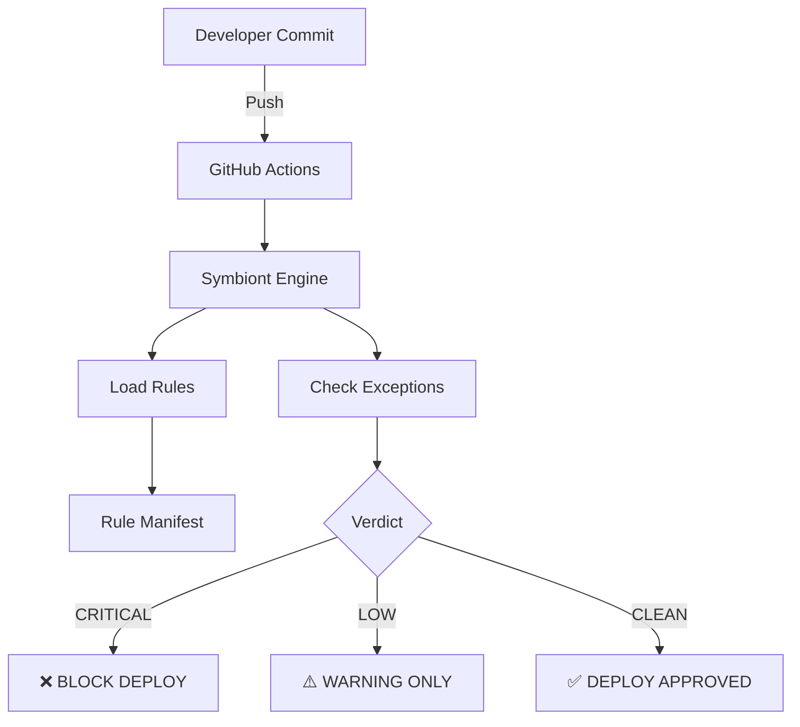

# 🏛️ Symbiont Governance Protocol


**Symbiont** é uma infraestrutura de governança como código projetada para ambientes de alta conformidade.

## 🚀 Capacidades do Core Engine
- **Auditoria Determinística:** Regras em Python puro.
- **Bloqueio Hard-Fail:** Impede merge de código inseguro.
- **Arquitetura Modular:** Regras via Manifesto JSON.

## 🛠️ Arquitetura do Sistema
```
	

